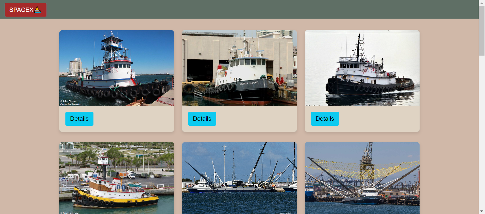

# SpaceX Data Fetcher

This project displays data about SpaceX ships, rockets, and launches using data fetched from the SpaceX API. The application allows users to view information about various SpaceX ships, rockets, and launches dynamically.

## Project Overview

- **HTML/CSS/JavaScript**: The frontend is built using HTML, CSS, and JavaScript.
- **API**: The project fetches data from the SpaceX API to display information about ships, rockets, and launches.

## Features

- **Fetch Ship Data**: Displays information about SpaceX ships.
- **Fetch Rocket Data**: Displays information about SpaceX rockets.
- **Fetch Launch Data**: Displays information about SpaceX launches.
- **Responsive Design**: The layout adapts to different screen sizes.

## Screenshots

### Main Page


### Ship Data



### Ship Data


### Rocket Data
This section is a placeholder for fetching and displaying data about SpaceX rockets. Currently, only the ships data functionality is implemented. The rocket data will be fetched from the SpaceX API in a similar way, using a button to trigger the fetch request and display the data dynamically in a card format.

### Launch Data
Similar to the rocket data, this section is also a placeholder. The launches data will display information about SpaceX launches. This feature will be developed in future versions of the project.

## File Structure

- `index.html`: Main HTML file containing the structure of the webpage.
- `ships.css`: CSS file for styling the webpage.
- `ships.js`: JavaScript file for fetching and displaying data.
- `README.md`: This file.

## Installation

1. Clone the repository:
    ```bash
    git clone <repository_url>
    ```

2. Open `index.html` in a web browser.

## Usage

1. **View Ships**:
   - Click the "Ships Data" button to fetch and display data about SpaceX ships.

2. **View Rockets**:
   - Click the "ROCKETS Data" button to fetch and display data about SpaceX rockets.

3. **View Launches**:
   - Click the "LAUNCHES Data" button to fetch and display data about SpaceX launches.

## Dependencies

- **Bootstrap 5**: For styling and responsive design.
- **Animate.css**: For animations (optional, if used).

## API Details

- **Base URL**: `https://api.spacexdata.com/v3/`
- **Endpoints**:
  - `/ships`: Fetch data about ships.
  - `/rockets`: Fetch data about rockets.
  - `/launches`: Fetch data about launches.
  - `/ships/{ship_id}`: Fetch detailed information about a specific ship.

## Contributing

Feel free to fork the repository and submit pull requests. For any issues or feature requests, please open an issue in the repository.

## License

This project is licensed under the MIT License.

